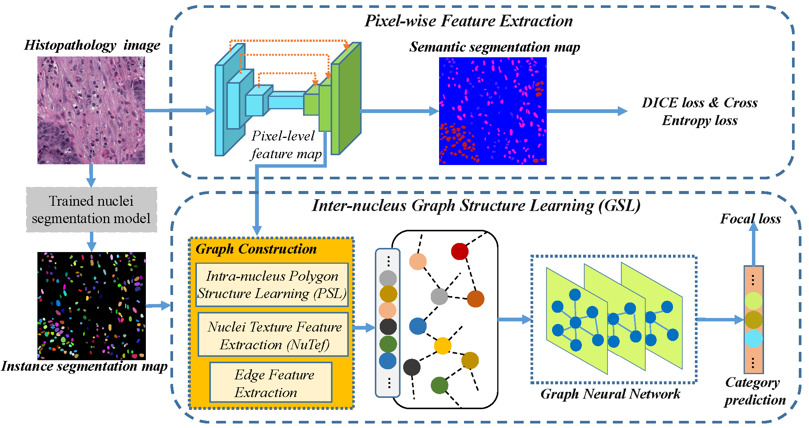

# Structure Embedded Nucleus Classification for Histopathology Images (SENUCLS)

This is the official PyTorch implementation of SENUCLS, a graph neural network based method for nuclei classification. The framework consists of a pixel-wise feature extraction branch (upper) and an instance-level classification branch (lower) using the inter-nucleus Graph Structure Learning module (GSL). 

In the GSL module, an intra-nucleus Polygon Structure Learning module (PSL) computes the shape features of nuclei. Then the input image is transformed into a graph and a GNN enhances the features of the graph nodes for nuclei classification.

Part of these codes including WSI inference and metrics computation are from the implementation of [Hover-Net](https://github.com/vqdang/hover_net/).

> **If you intend to use anything from this repo, citation of the original publication given above is necessary**



## Set Up Environment
```
conda env create -f environment.yml
conda activate hovernet
pip install torch==1.10.0 torchvision==0.11.1
pip install torch-geometric torch-scatter torch-sparse
```

## Datasets
- [CoNSeP](https://www.sciencedirect.com/science/article/pii/S1361841519301045)
- [PanNuke](https://arxiv.org/abs/2003.10778)
- [MoNuSAC](https://ieeexplore.ieee.org/abstract/document/8880654)


# Running the Code

## Training

### Data Format
For training, patches must be extracted using `extract_patches.py`. For each patch, patches are stored as a 4 dimensional numpy array with channels [RGB, inst]. Here, inst is the instance segmentation ground truth. I.e pixels range from 0 to N, where 0 is background and N is the number of nuclear instances for that particular image. 

Before training:

- Set path to the data directories in `config.py`
- Set path where checkpoints will be saved  in `config.py`
- Set path to pretrained VAN-base weights in `models/senucls/opt.py`. Download the weights [here](https://drive.google.com/file/d/1ne9rpzimYh7EyaUU5kfDd2nDzl04LJ5v/view?usp=sharing).
- Modify hyperparameters, including number of epochs and learning rate in `models/senucls/opt.py`.
- Set edge number, point number and class weights for Focal loss in `models/senucls/run_desc.PY`.

- To initialise the training script with GPUs 0, the command is:
```
python run_train.py --gpu='0' 
```

## Inference

### Data Format

Input: <br />
- Standard images files, including `png`, `jpg` and `tiff`.
- WSIs supported by [OpenSlide](https://openslide.org/), including `svs`, `tif`, `ndpi` and `mrxs`.
- Instance segmentation results output from other methods, like HoverNet or MaskRCNN. The formats of the segmentation results are '.mat'. The filename should match the testing images.

### Inference codes for tiles
```
python -u run_infer.py \
--gpu='0' \
--nr_types=6 \ # number of types + 1
--type_info_path=type_info.json \
--batch_size=1 \
--model_mode=original \
--model_path=.tar \ # choose the trained weights
--nr_inference_workers=1 \
--nr_post_proc_workers=16 \
tile \
--input_dir='PaNuKe/Fold3/images/' \ # testing tile path
--output_dir=panuke_out/ \  # output path
--inst_dir='inst_prediction/' \ # instance segmentation results path
--mem_usage=0.1 \
--save_qupath
```
Output: : <br />
- mat files / JSON files : Including centroid coordinates and nuclei types.
- overlay images: Visualization of the classification results.

### Inference codes for WSI
```
python run_infer.py \
--gpu='0' \
--nr_types=6 \ # number of types + 1
--type_info_path=type_info.json \
--batch_size=1 \
--model_mode=original \
--model_path=.tar \ # choose the trained weights
--nr_inference_workers=1 \
--nr_post_proc_workers=0 \
wsi \
--input_dir='test/wsi/' \ # testing wsi path
--output_dir='wsi_out/' \ # output path
--inst_pred_dir='test/inst_pred/' \ # instance segmentation results path
--proc_mag=20 \
--input_mask_dir='test/msk/' \
--save_thumb \
--save_mask
```
Output: : <br />
- JSON files : Including centroid coordinates and nuclei types.

Post process to .svs file: <br />
```
python prediction2svs.py # change input file name in the codes
```
## Evaluation:
To calculate the metrics used in this paper, run the command:
- type classification: `python compute_stats.py --mode=type --pred_dir='pred_dir' --true_dir='true_dir'`


## Citation

If any part of this code is used, please give appropriate citations to our paper. <br />

BibTex entry: <br />
```
@misc{lou2023structure,
      title={Structure Embedded Nucleus Classification for Histopathology Images}, 
      author={Wei Lou and Xiang Wan and Guanbin Li and Xiaoying Lou and Chenghang Li and Feng Gao and Haofeng Li},
      year={2023},
      eprint={2302.11416},
      archivePrefix={arXiv},
      primaryClass={cs.CV}
}
```
